<div align="center">

# 🎯 Event Management System

[](https://nodejs.org/)
[](https://www.fastify.io/)
[](LICENSE)

**A high-performance, resilient Event Management System featuring optimized query patterns and circuit breaker implementation for external service reliability.**

[Quick Start](#-quick-start) • [API Docs](#-api-endpoints) • [Performance](#-performance-optimizations) • [Resilience](#%EF%B8%8F-resilience-patterns)

</div>

---

## 📋 Table of Contents
- [Quick Start](#-quick-start)
- [Architecture](#%EF%B8%8F-architecture)
- [API Endpoints](#-api-endpoints)
- [Performance Optimizations](#-performance-optimizations)
- [Resilience Patterns](#%EF%B8%8F-resilience-patterns)
- [Configuration](#%EF%B8%8F-configuration)
- [Development](#-development)
- [Production Considerations](#-production-considerations)

---

## 🚀 Quick Start

### Prerequisites


### Installation

```bash
npm install
```

### Running the Application

```bash
# Production mode
npm start

# Development mode with auto-reload (Node 18+)
npm run dev
```

The server will start on `http://localhost:3000`

> [!TIP]
> Use `npm run dev` for development - it includes auto-reload on file changes (requires Node.js 18+)

---

## 🏗️ Architecture

### Tech Stack
- **Framework**: Fastify 4.28.0 - High-performance web framework
- **Testing**: MSW (Mock Service Worker) 2.7.3 - API mocking for development
- **Runtime**: Node.js 18+

### Project Structure

```text
challenge-backend/
├── services/
│   └── index.js              # Main application & API endpoints
├── utils/
│   ├── circuit-breaker.js    # Circuit breaker implementation
│   └── logger.js             # Logging utility
├── mock-server/
│   ├── index.js              # MSW configuration
│   └── mocks/
│       └── user.json         # Mock data
├── .env.example              # Environment variables template
├── .eslintrc.json            # ESLint configuration
└── package.json
```

---

## 📡 API Endpoints

**Base URL:** `http://localhost:3000`

### `GET /getUsers`

Returns list of all users.

<details>
<summary><b>Response Example</b></summary>

**Status:** `200 OK`

```json
[
  {
    "id": "1",
    "name": "User Name",
    "events": ["event-1", "event-2"]
  }
]
```

</details>

---

### `GET /getEventsByUserId/:id`

Returns all events for a specific user.

**Parameters:**
| Name | Type | Description |
|------|------|-------------|
| `id` | path | User ID |

> [!NOTE]
> This endpoint is **optimized with parallel fetching** for maximum performance. See [Performance Optimizations](#performance-optimizations).

<details>
<summary><b>Response Example</b></summary>

**Status:** `200 OK`

```json
[
  {
    "id": "event-1",
    "name": "Event Name",
    "userId": "1"
  }
]
```

</details>

---

### `GET /getEvents`

Returns list of all events.

**Status:** `200 OK`

---

### `POST /addEvent`

Creates a new event.

> [!IMPORTANT]
> This endpoint is **protected by a circuit breaker** to handle external service failures gracefully. See [Resilience Patterns](#resilience-patterns).

**Request Body:**

```json
{
  "name": "Event Name",
  "userId": "3"
}
```

**Responses:**

| Status | Condition |
|--------|-----------|
| `200 OK` | Event created successfully |
| `503 Service Unavailable` | Circuit breaker is open (service degraded) |

**Example Request:**

```bash
curl -X POST http://localhost:3000/addEvent \
  -H 'Content-Type: application/json' \
  -d '{"name": "Team Meeting", "userId": "3"}'
```

---

## ⚡ Performance Optimizations

### Problem: N+1 Query Pattern in `/getEventsByUserId`

**Original Implementation**:
The endpoint was fetching events sequentially in a loop:

```javascript
for(let i = 0; i < userEvents.length; i++) {
    const event = await fetch('http://event.com/getEventById/' + userEvents[i]);
    const eventData = await event.json();
    eventArray.push(eventData);
}
```

**Impact:**

| Scenario | Response Time | Complexity |
|----------|---------------|------------|
| 10 events | **5 seconds** | O(n × 500ms) |
| 50 events | **25 seconds** | O(n × 500ms) |

> [!WARNING]
> This N+1 pattern causes linear performance degradation as event count increases!

**Solution:** Parallel Fetching with `Promise.all()`

```javascript
const eventPromises = userEvents.map(eventId =>
    fetch('http://event.com/getEventById/' + eventId).then(resp => resp.json())
);
const eventArray = await Promise.all(eventPromises);
```

**Results:**

| Scenario | Before | After | Improvement |
|----------|--------|-------|-------------|
| 10 events | 5s | **~500ms** | ⚡ **90% faster** |
| 50 events | 25s | **~500ms** | ⚡ **98% faster** |

**Complexity:** O(500ms) - constant time regardless of event count! ✨

<details>
<summary><b>📝 Key Implementation Decisions</b></summary>

- ✅ Used native `Promise.all()` instead of external libraries (lodash, p-map) to minimize dependencies
- ✅ Maintained backward compatibility - no API contract changes
- ✅ Error handling: Fail-fast approach (if any event fetch fails, entire request fails)

</details>

---

## 🛡️ Resilience Patterns

### Problem: External Service Failures

The `/addEvent` endpoint depends on an external API that fails under high load.

> [!NOTE]
> **Mock Service Behavior:**
> - ✅ Succeeds for the first 5 requests
> - ❌ Fails with 503 for the next 10 requests
> - 🔄 Resets after 15 total requests

**Without protection:** Cascading failures and poor user experience ❌

### Solution: Custom Circuit Breaker Implementation

**Implementation:** [`utils/circuit-breaker.js`](utils/circuit-breaker.js)

#### Circuit States

```mermaid
stateDiagram-v2
    [*] --> CLOSED
    CLOSED --> OPEN: 3+ failures in 30s
    OPEN --> HALF_OPEN: Wait timeout expires
    HALF_OPEN --> CLOSED: Request succeeds ✓
    HALF_OPEN --> OPEN: Request fails (backoff++)
```



| State | Description | Behavior |
|-------|-------------|----------|
| 🟢 **CLOSED** | Normal Operation | All requests pass through to external service. Tracks failures within time window. |
| 🔴 **OPEN** | Service Degraded | Rejects requests immediately without calling external service. Returns 503 with retry information. |
| 🟡 **HALF_OPEN** | Testing Recovery | Allows limited test requests through. Success → CLOSED. Failure → OPEN with exponential backoff. |

#### Configuration

```javascript
{
  failureThreshold: 3,        // Open circuit after 3 failures
  failureWindowMs: 30000,     // Within 30-second window
  resetTimeoutMs: 10000,      // Initial retry after 10s
  maxResetTimeoutMs: 60000    // Max backoff of 60s
}
```

#### Exponential Backoff Strategy

| Attempt | Wait Time |
|---------|-----------|
| 1st | ⏱️ 10s |
| 2nd | ⏱️ 20s |
| 3rd | ⏱️ 40s |
| 4th+ | ⏱️ 60s (capped) |

**Error Responses**:

When circuit is OPEN:
```json
{
  "success": false,
  "error": "Service temporarily unavailable",
  "message": "Event service is currently experiencing issues. Please try again later.",
  "retryAfter": 10,
  "circuitBreakerState": "OPEN"
}
```

**Why Custom Implementation?**

Per requirements, no third-party circuit breaker libraries (like opossum, cockatiel) were used. Benefits:
- Full control over behavior
- No additional dependencies
- Educational value
- Customizable for specific requirements

**Key Features**:
-  Detects 3+ failures within 30-second window
-  Exponential backoff with jitter protection
-  Gradual recovery testing (HALF_OPEN state)
-  Appropriate client error messages
-  Logging for observability

---

## ⚙️ Configuration

### Environment Variables

> [!TIP]
> Copy `.env.example` to `.env` and customize for your environment:
> ```bash
> cp .env.example .env
> ```

**Available Variables:**

| Variable | Default | Description |
|----------|---------|-------------|
| `PORT` | 3000 | Server port |
| `NODE_ENV` | development | Environment (development/production) |
| `EVENT_API_BASE_URL` | http://event.com | External API base URL |
| `CIRCUIT_BREAKER_FAILURE_THRESHOLD` | 3 | Failures before opening circuit |
| `CIRCUIT_BREAKER_FAILURE_WINDOW_MS` | 30000 | Time window for counting failures (ms) |
| `CIRCUIT_BREAKER_RESET_TIMEOUT_MS` | 10000 | Initial retry timeout (ms) |
| `CIRCUIT_BREAKER_MAX_RESET_TIMEOUT_MS` | 60000 | Maximum backoff timeout (ms) |

> [!NOTE]
> Currently, environment variable support is configured but not yet implemented in code.
>
> **To fully enable:**
> 1. Install dotenv: `npm install dotenv`
> 2. Add to `services/index.js`: `require('dotenv').config()`
> 3. Replace hardcoded values with `process.env.VARIABLE_NAME`

---

## 🔧 Development

### Code Quality

**Linting** (ESLint):
```bash
# Check for issues
npm run lint

# Auto-fix issues
npm run lint:fix
```

**ESLint Configuration**:
- Extends: `eslint:recommended`
- Style: 2-space indentation, single quotes, semicolons required
- Environment: Node.js, ES2021

### Testing

> [!WARNING]
> **Current Status:** Test framework not yet implemented (time constraints)

**Recommended Setup:**

```bash
npm install --save-dev jest supertest
```

<details>
<summary><b>Proposed Test Structure</b></summary>

```text
tests/
├── unit/
│   ├── circuit-breaker.test.js
│   └── logger.test.js
├── integration/
│   └── endpoints.test.js
└── setup.js
```

**Priority Tests:**
1. ✅ Circuit breaker state transitions
2. ✅ Parallel event fetching
3. ✅ Error handling
4. ✅ API contract validation

</details>

### Development Workflow

1. **Install dependencies**: `npm install`
2. **Run in dev mode**: `npm run dev` (auto-reloads on file changes)
3. **Lint before commit**: `npm run lint:fix`
4. **Test manually**: Use provided curl commands or Postman

---

## 🚢 Production Considerations

### ✅ What's Been Implemented

 **Performance Optimization**: Parallel query execution
 **Resilience Pattern**: Circuit breaker with exponential backoff
 **Code Quality**: ESLint configuration
 **Documentation**: Comprehensive README
 **Environment Config**: Template for environment variables
 **Version Control**: .gitignore configured

### 🔮 What Should Be Added (Time Permitting)

<details open>
<summary><b>🔴 High Priority</b></summary>

#### 1. Environment Variable Integration
- Install dotenv package
- Load environment variables in application
- Validate required variables on startup

#### 2. Error Handling Middleware
   ```javascript
   fastify.setErrorHandler((error, request, reply) => {
     fastify.log.error(error);
     reply.status(error.statusCode || 500).send({
       error: error.message,
       statusCode: error.statusCode || 500
     });
   });
   ```

3. **Request Validation**
   ```javascript
   const addEventSchema = {
     body: {
       type: 'object',
       required: ['name', 'userId'],
       properties: {
         name: { type: 'string', minLength: 1 },
         userId: { type: 'string', minLength: 1 }
       }
     }
   };
   ```

4. **Structured Logging**
   - Replace console.log with structured JSON logging (pino is built into Fastify)
   - Add request/response logging middleware
   - Include correlation IDs for tracing

#### 5. Health Check Endpoints
   ```javascript
   fastify.get('/health', async () => ({ status: 'ok' }));
   fastify.get('/ready', async () => {
     // Check external service connectivity
     // Check circuit breaker state
     return { ready: true };
   });
   ```

</details>

<details>
<summary><b>🟡 Medium Priority</b></summary>

- **Rate Limiting** - Prevent abuse
- **CORS Configuration** - If serving browser clients
- **Metrics/Monitoring** - Prometheus, Datadog
- **Containerization** - Dockerfile, docker-compose.yml
- **CI/CD Pipeline** - GitHub Actions, GitLab CI

</details>

<details>
<summary><b>🟢 Future Enhancements</b></summary>

- **Caching Layer** - Redis for event data
- **Database Integration** - PostgreSQL, MongoDB
- **Authentication/Authorization** - JWT, OAuth
- **API Versioning** - `/v1/`, `/v2/`
- **OpenAPI/Swagger Documentation**

</details>

### Deployment

**Recommended Platforms**:
- **Docker**: Containerize with Alpine Node image
- **Cloud**: AWS ECS, Google Cloud Run, Azure Container Apps
- **Platform**: Heroku, Railway, Render

**Production Checklist**:
- [ ] Enable HTTPS/TLS
- [ ] Set NODE_ENV=production
- [ ] Configure log aggregation
- [ ] Set up monitoring/alerting
- [ ] Configure auto-scaling
- [ ] Enable health checks
- [ ] Set up backup/disaster recovery
- [ ] Security audit (npm audit, Snyk)

---

## 📊 Performance Metrics

### `/getEventsByUserId` Improvements

| Events | Before ⏱️ | After ⚡ | Improvement 📈 |
|--------|-----------|---------|----------------|
| 5 | 2.5s | ~500ms | **80% faster** 🚀 |
| 10 | 5.0s | ~500ms | **90% faster** 🚀 |
| 20 | 10.0s | ~500ms | **95% faster** 🚀 |
| 50 | 25.0s | ~500ms | **98% faster** 🚀 |

### `/addEvent` Resilience Comparison

| Aspect | ❌ Without Circuit Breaker | ✅ With Circuit Breaker |
|--------|---------------------------|-------------------------|
| **Failures** | Cascading failures during outages | Immediate feedback (503 with retry info) |
| **Load** | No backoff → amplifies external service load | Reduced load on failing service (fail-fast) |
| **Recovery** | Manual intervention required | Automatic recovery testing |
| **UX** | Poor (timeouts, errors) | Graceful degradation |

---

## 🔍 Troubleshooting

### Common Issues

<details>
<summary><b>🔴 Circuit breaker frequently opening</b></summary>

**Cause:** External service genuinely experiencing issues

**Solution:** Check external service status, adjust thresholds if needed

</details>

<details>
<summary><b>🐌 Slow /getEventsByUserId despite optimization</b></summary>

**Cause:** External API still has 500ms delay (intentional in mock)

**Solution:** This is expected behavior; optimization reduces the multiplier effect

</details>

<details>
<summary><b>❌ ESLint errors on first run</b></summary>

**Cause:** ESLint not installed

**Solution:** Run `npm install` to install dev dependencies

</details>

---

## 📄 License

ISC

## 🤝 Contributing

1. 🍴 Fork the repository
2. 🌿 Create a feature branch
3. ✏️ Make your changes
4. ✅ Run `npm run lint:fix`
5. 📬 Submit a pull request

---

<div align="center">

## 🎓 Acknowledgments

Built as part of a technical challenge to demonstrate:

**Performance Optimization** • **Resilience Patterns** • **Production-Ready Configuration** • **Technical Documentation**

---

⭐ **Found this helpful? Give it a star!** ⭐

</div>
